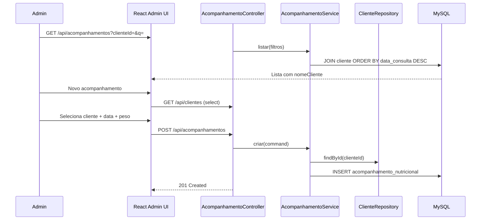

# Acompanhamento Nutricional — Design

**Spec:** `.specs/features/acompanhamento-nutricional/spec.md`  
**Arquitetura compartilhada:** `.specs/project/SYSTEM-DESIGN.md`  
**Status:** ✅ Done (2026-05-30)

---

## Architecture Overview

Fluxo admin autenticado: listagem de consultas nutricionais (com filtro por cliente e busca textual) → formulário vinculado a um `Cliente` existente. Sem upload de arquivos. Validações de datas e peso no backend e espelhadas no frontend.



---

## Code Reuse Analysis

### Existing Components to Leverage

| Component | Location | How to Use |
| --------- | -------- | ---------- |
| `Cliente` entity + `ClienteRepository` | domain/repository | FK obrigatória; listagem join para nome |
| `clientesApi.listar` | frontend | Popular `<select>` de clientes no formulário |
| `ClienteListPage` pattern | frontend | Tabela, debounce, filtros |
| `MaquinaService` / `ClienteService` (novo) | backend | Template CRUD + listagem filtrada |
| `GlobalExceptionHandler` | backend | `AcompanhamentoNotFoundException`, `ClienteNotFoundException` |
| `SecurityConfig` | backend | Adicionar `/api/acompanhamentos/**` autenticado |

### Integration Points

| System | Integration Method |
| ------ | ------------------ |
| `cliente` table | FK `cliente_id` NOT NULL |
| Spring Security | Rotas API autenticadas |
| Flyway | `V4__acompanhamento_nutricional.sql` (após V3 maquinas) |

---

## Components

### AcompanhamentoNutricionalController (backend)

- **Purpose:** REST CRUD de acompanhamentos nutricionais.
- **Location:** `backend/.../web/AcompanhamentoNutricionalController.java`
- **Interfaces:**
  - `GET /api/acompanhamentos(?clienteId=&q=): List<AcompanhamentoSummaryDto>`
  - `POST /api/acompanhamentos(CreateAcompanhamentoRequest): AcompanhamentoDto`
  - `GET /api/acompanhamentos/{id}: AcompanhamentoDto`
  - `PUT /api/acompanhamentos/{id}(UpdateAcompanhamentoRequest): AcompanhamentoDto`
  - `PATCH /api/acompanhamentos/{id}/status(StatusRequest): AcompanhamentoDto` — reutiliza `StatusRequest` se enum compatível ou DTO dedicado `AcompanhamentoStatusRequest`
- **Dependencies:** `AcompanhamentoNutricionalService`
- **Reuses:** Query params `clienteId` + `q` combináveis

### AcompanhamentoNutricionalService (backend)

- **Purpose:** Validações de negócio — datas, peso, cliente existente, filtros.
- **Location:** `backend/.../service/AcompanhamentoNutricionalService.java`
- **Interfaces:**
  - `listar(Long clienteId, String query): List<AcompanhamentoSummary>`
  - `criar(CreateAcompanhamentoCommand): AcompanhamentoNutricional`
  - `buscarPorId(Long id): AcompanhamentoNutricional`
  - `atualizar(Long id, UpdateAcompanhamentoCommand): AcompanhamentoNutricional`
  - `alterarStatus(Long id, AcompanhamentoStatus status): AcompanhamentoNutricional`
  - `validarDatas(LocalDate dataConsulta, LocalDate proximaConsulta): void`
  - `validarPeso(BigDecimal pesoKg): void`
- **Dependencies:** `AcompanhamentoNutricionalRepository`, `ClienteRepository`
- **Reuses:** `@Transactional`; cliente inativo permitido (spec edge case)

### AcompanhamentoNutricionalRepository (backend)

- **Purpose:** Queries com join/filtro.
- **Location:** `backend/.../repository/AcompanhamentoNutricionalRepository.java`
- **Interfaces:**
  - `findAllByOrderByDataConsultaDesc()`
  - `@Query` com JOIN cliente — filtro `clienteId`, `q` em nome cliente ou profissional
- **Dependencies:** Spring Data JPA

### AcompanhamentoListPage (frontend)

- **Purpose:** Listagem com filtro por cliente (select), busca debounced, badge status, toggle inativar.
- **Location:** `frontend/src/routes/AcompanhamentoListPage.tsx`
- **Interfaces:**
  - Filtro `<ClienteSelect>` — carrega de `clientesApi.listar()`
  - Campo busca — repassa `q` à API
- **Dependencies:** `acompanhamentosApi`, `clientesApi`
- **Reuses:** Layout de `ClienteListPage`; inativos visíveis com badge cinza (decisão: **mostrar inativos** na listagem default)

### AcompanhamentoFormPage (frontend)

- **Purpose:** Form create/edit — cliente (select só no create), data consulta, peso, profissional, objetivo, orientações, próxima consulta.
- **Location:** `frontend/src/routes/AcompanhamentoFormPage.tsx`
- **Interfaces:**
  - Create: `/admin/acompanhamentos/novo`
  - Edit: `/admin/acompanhamentos/:id/editar` — cliente exibido read-only (nome + link)
- **Dependencies:** `acompanhamentosApi`, `clientesApi`
- **Reuses:** Validação client-side de datas (não futura) e peso 20–500

### acompanhamentosApi (frontend)

- **Purpose:** Wrapper API.
- **Location:** `frontend/src/api/acompanhamentosApi.ts`, `frontend/src/types/acompanhamento.ts`
- **Interfaces:** `listar({ clienteId?, q? })`, `buscar`, `criar`, `atualizar`, `alterarStatus`

### ClienteSelect (frontend) — componente compartilhável

- **Purpose:** Select searchable de clientes para formulário e filtro da listagem.
- **Location:** `frontend/src/components/ClienteSelect.tsx`
- **Interfaces:** `value`, `onChange`, `disabled?`
- **Dependencies:** `clientesApi.listar()`
- **Reuses:** Pode ser usado depois em outras features admin

---

## Data Models

### Flyway — `V4__acompanhamento_nutricional.sql`

```sql
CREATE TABLE acompanhamento_nutricional (
    id BIGINT AUTO_INCREMENT PRIMARY KEY,
    cliente_id BIGINT NOT NULL,
    data_consulta DATE NOT NULL,
    peso_kg DECIMAL(5, 2) NULL,
    profissional VARCHAR(120) NULL,
    objetivo VARCHAR(200) NULL,
    orientacoes VARCHAR(2000) NULL,
    proxima_consulta DATE NULL,
    status ENUM('ATIVO', 'INATIVO') NOT NULL DEFAULT 'ATIVO',
    created_at TIMESTAMP NOT NULL DEFAULT CURRENT_TIMESTAMP,
    updated_at TIMESTAMP NOT NULL DEFAULT CURRENT_TIMESTAMP ON UPDATE CURRENT_TIMESTAMP,
    CONSTRAINT fk_acompanhamento_cliente FOREIGN KEY (cliente_id) REFERENCES cliente (id)
);

CREATE INDEX idx_acompanhamento_cliente_data ON acompanhamento_nutricional (cliente_id, data_consulta DESC);
```

### AcompanhamentoNutricional (entity)

```java
@Entity
@Table(name = "acompanhamento_nutricional")
public class AcompanhamentoNutricional {
    Long id;
    @ManyToOne(optional = false)
    Cliente cliente;
    LocalDate dataConsulta;
    BigDecimal pesoKg;              // optional, 20.00–500.00
    String profissional;            // max 120
    String objetivo;                // max 200
    String orientacoes;             // max 2000
    LocalDate proximaConsulta;      // optional, >= dataConsulta when set
    AcompanhamentoStatus status;    // ATIVO | INATIVO
    Instant createdAt;
    Instant updatedAt;
}
```

### DTOs

```java
record CreateAcompanhamentoRequest(
    @NotNull Long clienteId,
    @NotNull @PastOrPresent LocalDate dataConsulta,
    @DecimalMin("20.0") @DecimalMax("500.0") BigDecimal pesoKg,
    @Size(max = 120) String profissional,
    @Size(max = 200) String objetivo,
    @Size(max = 2000) String orientacoes,
    LocalDate proximaConsulta
) {}

record AcompanhamentoSummaryDto(
    Long id,
    Long clienteId,
    String clienteNome,
    LocalDate dataConsulta,
    BigDecimal pesoKg,
    String profissional,
    AcompanhamentoStatus status,
    Instant createdAt
) {}
```

> `@PastOrPresent` em `dataConsulta`; validação custom `@AssertTrue` ou service check: `proximaConsulta == null || !proximaConsulta.isBefore(dataConsulta)`.

### TypeScript

```typescript
export type AcompanhamentoStatus = 'ATIVO' | 'INATIVO';

export interface AcompanhamentoSummary {
  id: number;
  clienteId: number;
  clienteNome: string;
  dataConsulta: string; // ISO date
  pesoKg: number | null;
  profissional: string | null;
  status: AcompanhamentoStatus;
  createdAt: string;
}
```

---

## Error Handling Strategy

| Error Scenario | Handling | User Impact |
| -------------- | -------- | ----------- |
| Cliente inexistente | `ClienteNotFoundException` → 404 | "Cliente não encontrado" |
| Data consulta futura | Validation 400 | "Data não pode ser futura" |
| Peso fora de 20–500 | Validation 400 | Mensagem no campo peso |
| proximaConsulta < dataConsulta | `IllegalArgumentException` → 400 | "Próxima consulta deve ser após a data da consulta" |
| Acompanhamento não encontrado | 404 | Erro ao carregar edição |
| Cliente inativo no create | Permitido | Sem bloqueio (spec) |
| Sessão expirada | 401 | Redirect login |

---

## Tech Decisions

| Decision | Choice | Rationale |
| -------- | ------ | --------- |
| Cliente após criação | Read-only na edição | Evita quebra de histórico; spec assumption |
| Inativos na listagem | Visíveis com badge | Spec default; toggle reativa |
| Filtro cliente | Query param `clienteId` | RESTful; combina com `q` |
| Ordenação | `data_consulta DESC` | Consultas recentes primeiro |
| Status enum | Reutilizar padrão ATIVO/INATIVO | Alinhado a `ClienteStatus` naming |
| Tipo de data | `LocalDate` (sem hora) | Consulta nutricional é evento diário |
| Migration | V4 após V3 (maquinas) | Ordem de deploy das duas features |

---

## Requirement Mapping (Design)

| ID | Componente(s) |
| -- | ------------- |
| NUT-01..03 | AcompanhamentoListPage, Controller.listar |
| NUT-04..08 | AcompanhamentoFormPage, Service.criar, validações |
| NUT-09..10 | ProtectedRoute, AdminLayout, SecurityConfig |
| NUT-11..13 | AcompanhamentoFormPage edit, Controller.atualizar |
| NUT-14..16 | ListPage toggle status, Controller.alterarStatus |
| NUT-17..18 | ListPage filtro ClienteSelect, Service.listar(clienteId) |
| NUT-19..20 | ListPage busca, Service.listar(q) |

---

## Test Strategy

| Layer | Arquivo | Foco |
| ----- | ------- | ---- |
| Service unit | `AcompanhamentoNutricionalServiceTest` | datas, peso, cliente FK, filtros |
| Controller integration | `AcompanhamentoNutricionalControllerWebTest` | CRUD, filtros, 400/404 |
| Frontend unit | `AcompanhamentoListPage.test.tsx`, `AcompanhamentoFormPage.test.tsx`, `acompanhamentosApi.test.ts` | filtro, submit, validação |

**Gate:** `quick-backend` + `full-backend` + `quick-frontend`

---

## Ordem de implementação sugerida (entre as 2 features)

1. **cadastro-maquinas** — sem FK externa; menor acoplamento
2. **acompanhamento-nutricional** — depende de `cliente` existente; reutiliza padrões recém-criados

Ambas podem compartilhar um task de **AdminLayout + SecurityConfig** estendidos (commit único ou último task de integração de cada feature).
