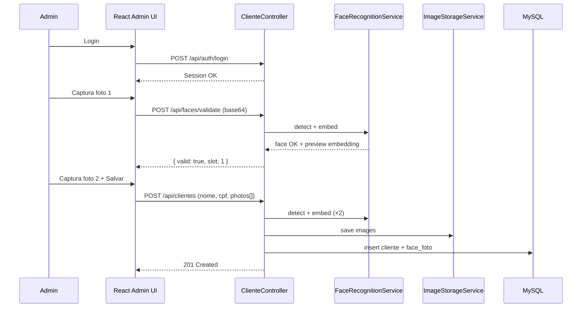

# Cadastro de Clientes e Faces — Design

**Spec:** `.specs/features/cadastro-clientes-faces/spec.md`  
**Arquitetura compartilhada:** `.specs/project/SYSTEM-DESIGN.md`  
**Status:** ✅ Done (2026-05-30)

---

## Architecture Overview

Fluxo admin autenticado: login → listagem → formulário de cadastro com captura sequencial de 2 fotos via webcam → validação facial no servidor a cada captura → persistência de cliente + imagens + embeddings.



---

## Code Reuse Analysis

### Existing Components to Leverage

| Component | Location | How to Use |
| --------- | -------- | ---------- |
| _Greenfield — nenhum código existente_ | — | Estabelecer padrões nesta feature |

### Integration Points

| System | Integration Method |
| ------ | ------------------ |
| FaceRecognitionService | Compartilhado com tela de entrada — cadastro chama `validateFace()` e `extractEmbedding()` |
| ImageStorageService | Abstração local/GCS — cadastro grava; entrada lê URL/path da foto matched |
| Spring Security + CORS | Protege `/api/clientes/**`; `ProtectedRoute` no React |
| Flyway | Migrations V1__schema.sql com tabelas compartilhadas |

---

## Components

### React Router (rotas admin)

- **Purpose:** Navegação SPA entre login, listagem e formulário de cadastro/edição.
- **Location:** `frontend/src/App.tsx`, `frontend/src/routes/`
- **Interfaces:**
  - `/login` → `LoginPage`
  - `/admin/clientes` → `ClienteListPage` (ProtectedRoute)
  - `/admin/clientes/novo` → `ClienteFormPage` (ProtectedRoute)
  - `/admin/clientes/:id/editar` → `ClienteFormPage` (ProtectedRoute)
- **Dependencies:** `useAuth`, React Router v6
- **Reuses:** `AdminLayout` wrapper com navbar Tailwind + logout

### AuthController (backend)

- **Purpose:** Autenticação por sessão do administrador.
- **Location:** `web/AuthController.java`
- **Interfaces:**
  - `POST /api/auth/login(LoginRequest): AuthResponse` — valida credenciais, cria sessão
  - `POST /api/auth/logout(): void` — invalida sessão
  - `GET /api/auth/me(): AdminUserDto` — usuário logado
- **Dependencies:** `AdminUserRepository`, `PasswordEncoder` (BCrypt)
- **Reuses:** Spring Security formLogin ou API + SecurityContext

### ClienteController

- **Purpose:** CRUD de clientes e orquestração de fotos faciais.
- **Location:** `web/ClienteController.java`
- **Interfaces:**
  - `GET /api/clientes(?q=): List<ClienteSummaryDto>` — listagem ordenada, busca P3
  - `POST /api/clientes(CreateClienteRequest): ClienteDto` — cadastro completo
  - `GET /api/clientes/{id}: ClienteDto` — detalhe com URLs das fotos
  - `PUT /api/clientes/{id}(UpdateClienteRequest): ClienteDto` — editar nome/cpf/fotos
  - `PATCH /api/clientes/{id}/status(StatusRequest): ClienteDto` — ativar/desativar
  - `GET /api/clientes/{id}/foto/{ordem}` — stream da imagem
- **Dependencies:** `ClienteService`, `@PreAuthorize("isAuthenticated()")`
- **Reuses:** DTOs com validação Jakarta (`@NotBlank`, CPF custom validator)

### FaceValidationController

- **Purpose:** Validar captura de webcam antes de incluir no formulário (CAD-07, CAD-08).
- **Location:** `web/FaceValidationController.java`
- **Interfaces:**
  - `POST /api/faces/validate(FaceImageRequest): FaceValidationResponse`
    - Input: `{ "imageBase64": "..." }`
    - Output: `{ "valid": true|false, "message": "...", "faceCount": 1 }`
- **Dependencies:** `FaceRecognitionService.detectFaces()`
- **Reuses:** Mesmo pipeline de detecção da entrada

### ClienteService

- **Purpose:** Regras de negócio de clientes — CPF único, status, persistência de fotos.
- **Location:** `service/ClienteService.java`
- **Interfaces:**
  - `listar(String query): List<ClienteSummary>`
  - `criar(CreateClienteCommand): Cliente`
  - `atualizar(Long id, UpdateClienteCommand): Cliente`
  - `alterarStatus(Long id, Status status): Cliente`
  - `mascararCpf(String cpf): String` — ex.: `***.456.789-**`
- **Dependencies:** `ClienteRepository`, `FaceFotoRepository`, `FaceRecognitionService`, `ImageStorageService`, `CpfValidator`
- **Reuses:** `@Transactional` para cadastro atômico cliente + 2 fotos

### CpfValidator

- **Purpose:** Validar dígitos verificadores do CPF brasileiro.
- **Location:** `service/CpfValidator.java`
- **Interfaces:**
  - `isValid(String cpf): boolean`
  - `normalize(String cpf): String` — remove pontuação
- **Dependencies:** nenhuma
- **Reuses:** Usado em DTO validation e ClienteService

### LoginPage + useAuth (frontend)

- **Purpose:** Formulário de login e contexto de autenticação global.
- **Location:** `frontend/src/routes/LoginPage.tsx`, `frontend/src/hooks/useAuth.ts`
- **Interfaces:**
  - `login(username, password): Promise<void>` — chama `authApi.login`, redireciona para `/admin/clientes`
  - `logout(): Promise<void>` — invalida sessão, redireciona para `/login`
  - `AuthProvider` — expõe `{ user, isAuthenticated, loading }`
- **Dependencies:** `authApi`, React Router `useNavigate`
- **Reuses:** Em `ProtectedRoute` — se 401 em `/api/auth/me`, redirect `/login`

### ClienteListPage (frontend)

- **Purpose:** Listagem de clientes com busca (P3) e ações de status.
- **Location:** `frontend/src/routes/ClienteListPage.tsx`
- **Interfaces:** consome `clientesApi.listar(q?)`, exibe tabela com CPF mascarado
- **Dependencies:** `AdminLayout`, `clientesApi`
- **Reuses:** Campo de busca com debounce 300ms

### ClienteFormPage + FaceCaptureWizard (frontend)

- **Purpose:** Formulário nome/CPF + wizard sequencial de 2 fotos via webcam.
- **Location:** `frontend/src/routes/ClienteFormPage.tsx`, `frontend/src/components/FaceCaptureWizard.tsx`
- **Interfaces:** state `{ slot: 1|2, photos: [string|null, string|null], errors }`
- **Dependencies:** `WebcamCapture`, `clientesApi`, `facesApi.validate`
- **Reuses:** Após cada captura chama `POST /api/faces/validate`; submit só com 2 fotos válidas

### WebcamCapture + useWebcam (frontend)

- **Purpose:** Componente reutilizável de preview webcam e captura base64.
- **Location:** `frontend/src/components/WebcamCapture.tsx`, `frontend/src/hooks/useWebcam.ts`
- **Interfaces:**
  - `useWebcam(): { videoRef, start, stop, captureFrame, error, isReady }`
  - `<WebcamCapture onCapture={base64 => ...} />`
- **Dependencies:** MediaDevices API, `<video ref>` + `<canvas>` offscreen
- **Reuses:** Cadastro e tela de entrada

### api/client.ts (frontend)

- **Purpose:** Wrapper fetch com cookies, CSRF e tratamento de 401.
- **Location:** `frontend/src/api/client.ts`
- **Interfaces:** `apiGet`, `apiPost`, `apiPut`, `apiPatch` — sempre `credentials: 'include'`
- **Dependencies:** lê cookie `XSRF-TOKEN` para header em mutações
- **Reuses:** Todos os módulos `*Api.ts`

---

## Data Models

### Cliente (entity)

```java
@Entity
@Table(name = "cliente")
public class Cliente {
    Long id;
    String nome;           // max 120
    String cpf;            // 11 digits, unique
    ClienteStatus status;  // ATIVO | INATIVO
    Instant createdAt;
    Instant updatedAt;
    List<FaceFoto> fotos;  // OneToMany, size=2 on active enrollment
}
```

**Relationships:** 1 Cliente → 2 FaceFoto (ordem 1 e 2)

### FaceFoto (entity)

```java
@Entity
@Table(name = "face_foto")
public class FaceFoto {
    Long id;
    Cliente cliente;
    int ordem;             // 1 or 2
    String storageKey;
    byte[] embedding;      // 512 floats serialized
    int embeddingDim;
    Instant createdAt;
}
```

### CreateClienteRequest (DTO)

```java
record CreateClienteRequest(
    @NotBlank String nome,
    @NotBlank @CpfValid String cpf,
    @Size(min=2, max=2) List<@NotBlank String> photosBase64
) {}
```

### ClienteSummaryDto

```java
record ClienteSummaryDto(
    Long id,
    String nome,
    String cpfMascarado,
    ClienteStatus status,
    Instant createdAt
) {}
```

---

## Error Handling Strategy

| Error Scenario | Handling | User Impact |
| -------------- | -------- | ----------- |
| CPF inválido | Bean validation 400 | Mensagem no campo CPF |
| CPF duplicado | `DuplicateCpfException` → 409 | "CPF já cadastrado" |
| Foto sem rosto | `FaceValidationResponse.valid=false` | "Rosto não detectado. Tente novamente." |
| Múltiplos rostos na captura | `faceCount > 1` → invalid | "Posicione apenas uma pessoa" |
| Webcam negada | `useWebcam` error state | Banner `<WebcamError />` com instrução |
| Sessão expirada | 401 em api client → redirect | `navigate('/login')`; perde dados não salvos |
| Falha ao salvar imagem GCS | rollback transação | "Erro ao salvar. Tente novamente." |

---

## Tech Decisions

| Decision | Choice | Rationale |
| -------- | ------ | --------- |
| Autenticação admin | Sessão HTTP + BCrypt | Spec exige login web simples; JWT desnecessário no MVP |
| Frontend admin | React + TypeScript + Vite + Tailwind | Componentização, rotas e utility-first styling |
| UI admin | `@tailwindcss/forms` + badges de status | Formulários e listagem consistentes |
| Validação facial no cadastro | Server-side via DJL | Garante que embeddings armazenados são confiáveis |
| 2 fotos obrigatórias | Wizard sequencial slot 1→2 | UX clara; atende spec |
| CPF na listagem | Mascarado `***.XXX.XXX-**` | Privacidade básica LGPD-friendly |
| Edição de fotos | Replace all (2 novas) | Simplifica sync de embeddings vs. replace parcial |

---

## Requirement Mapping (Design)

| ID | Componente(s) |
| -- | ------------- |
| CAD-01..04 | AuthController, SecurityConfig, LoginPage, useAuth, ProtectedRoute |
| CAD-05..09 | ClienteFormPage, FaceCaptureWizard, WebcamCapture, ClienteController |
| CAD-10..12 | ClienteListPage, ClienteController.listar |
| CAD-13..16 | ClienteFormPage (edit mode), ClienteController.atualizar |
| CAD-17..19 | ClienteListPage status toggle, ClienteController.alterarStatus |
| CAD-20..21 | ClienteListPage search, ClienteService.listar(query) |
