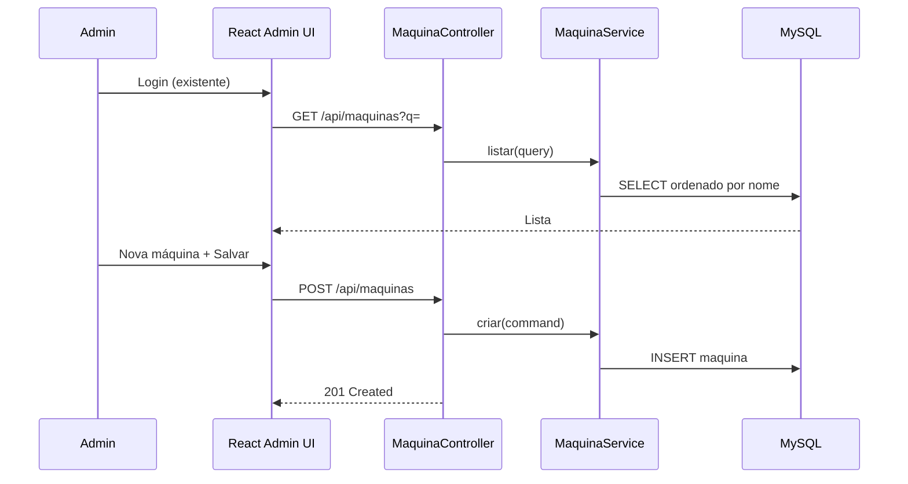

# Cadastro de Máquinas da Academia — Design

**Spec:** `.specs/features/cadastro-maquinas/spec.md`  
**Arquitetura compartilhada:** `.specs/project/SYSTEM-DESIGN.md`  
**Status:** ✅ Done (2026-05-30)

---

## Architecture Overview

Fluxo admin autenticado espelhando o padrão de clientes: login → listagem → formulário CRUD simples (sem webcam). Backend REST + JPA; frontend React com tabelas Tailwind, busca debounced e badges de status.



---

## Code Reuse Analysis

### Existing Components to Leverage

| Component | Location | How to Use |
| --------- | -------- | ---------- |
| `AuthController` + `useAuth` | backend/frontend auth | Sem alteração — sessão existente |
| `ProtectedRoute` | `frontend/src/components/ProtectedRoute.tsx` | Envolve rotas `/admin/maquinas/**` |
| `AdminLayout` | `frontend/src/components/AdminLayout.tsx` | Adicionar links Máquinas / Nova máquina |
| `ClienteController` + `ClienteService` | backend | **Template** para CRUD, busca `?q=`, PATCH status |
| `ClienteListPage` | `frontend/src/routes/ClienteListPage.tsx` | **Template** para tabela, debounce, empty state, toggle |
| `ClienteFormPage` | `frontend/src/routes/ClienteFormPage.tsx` | **Template** para create/edit, erros API |
| `clientesApi` + `api/client.ts` | `frontend/src/api/` | Mesmo padrão fetch + CSRF |
| `GlobalExceptionHandler` | `web/GlobalExceptionHandler.java` | Estender com `DuplicatePatrimonioException`, `MaquinaNotFoundException` |
| `SecurityConfig` | `config/SecurityConfig.java` | Adicionar `/api/maquinas/**` em rotas autenticadas |

### Integration Points

| System | Integration Method |
| ------ | ------------------ |
| Spring Security | `/api/maquinas/**` exige sessão autenticada |
| Flyway | Nova migration `V3__maquina.sql` |
| React Router | Rotas admin sob `AdminLayout` |

---

## Components

### MaquinaController (backend)

- **Purpose:** REST CRUD de máquinas da academia.
- **Location:** `backend/src/main/java/br/com/academia/faceaccess/web/MaquinaController.java`
- **Interfaces:**
  - `GET /api/maquinas(?q=): List<MaquinaSummaryDto>` — listagem alfabética, busca P3
  - `POST /api/maquinas(CreateMaquinaRequest): MaquinaDto` — cadastro
  - `GET /api/maquinas/{id}: MaquinaDto` — detalhe para edição
  - `PUT /api/maquinas/{id}(UpdateMaquinaRequest): MaquinaDto` — editar
  - `PATCH /api/maquinas/{id}/status(MaquinaStatusRequest): MaquinaDto` — ATIVA / MANUTENCAO / INATIVA
- **Dependencies:** `MaquinaService`, validação Jakarta
- **Reuses:** Assinaturas e status codes iguais a `ClienteController`

### MaquinaService (backend)

- **Purpose:** Regras de negócio — patrimônio único, normalização, listagem com filtro.
- **Location:** `backend/src/main/java/br/com/academia/faceaccess/service/MaquinaService.java`
- **Interfaces:**
  - `listar(String query): List<MaquinaSummary>`
  - `criar(CreateMaquinaCommand): Maquina`
  - `buscarPorId(Long id): Maquina`
  - `atualizar(Long id, UpdateMaquinaCommand): Maquina`
  - `alterarStatus(Long id, MaquinaStatus status): Maquina`
  - `normalizePatrimonio(String raw): String | null` — trim; blank → null
- **Dependencies:** `MaquinaRepository`
- **Reuses:** Padrão de commands/records de `ClienteService`; busca JPQL `LIKE` em nome, marca, codigo_patrimonio

### MaquinaRepository (backend)

- **Purpose:** Persistência JPA.
- **Location:** `backend/src/main/java/br/com/academia/faceaccess/repository/MaquinaRepository.java`
- **Interfaces:**
  - `findAllByOrderByNomeAsc()`
  - `findByNomeContainingIgnoreCaseOrMarcaContainingIgnoreCaseOrCodigoPatrimonioContainingIgnoreCase(...)`
  - `existsByCodigoPatrimonioAndIdNot(String codigo, Long excludeId)`
- **Dependencies:** Spring Data JPA

### MaquinaListPage (frontend)

- **Purpose:** Tabela de máquinas com busca, badges de status e toggle de status.
- **Location:** `frontend/src/routes/MaquinaListPage.tsx`
- **Interfaces:** consome `maquinasApi.listar(q?)`, ações editar + alterar status
- **Dependencies:** `AdminLayout`, `maquinasApi`
- **Reuses:** Estrutura de `ClienteListPage` — debounce 300ms, empty state, `StatusBadge` adaptado (3 estados)

### MaquinaFormPage (frontend)

- **Purpose:** Formulário create/edit — nome, tipo, marca, modelo, patrimônio, localização, observações.
- **Location:** `frontend/src/routes/MaquinaFormPage.tsx`
- **Interfaces:** rotas `/admin/maquinas/novo` e `/admin/maquinas/:id/editar`
- **Dependencies:** `maquinasApi`, React Router `useParams`
- **Reuses:** Padrão submit/loading/error de `ClienteFormPage` (sem wizard de fotos)

### maquinasApi (frontend)

- **Purpose:** Wrapper API máquinas.
- **Location:** `frontend/src/api/maquinasApi.ts`, `frontend/src/types/maquina.ts`
- **Interfaces:** `listar`, `buscar`, `criar`, `atualizar`, `alterarStatus`
- **Dependencies:** `api/client.ts`

### AdminLayout + App.tsx (frontend)

- **Purpose:** Navegação e registro de rotas.
- **Location:** `frontend/src/components/AdminLayout.tsx`, `frontend/src/App.tsx`
- **Changes:**
  - Links: `Máquinas`, `Nova máquina`
  - Rotas protegidas: `/admin/maquinas`, `/admin/maquinas/novo`, `/admin/maquinas/:id/editar`

---

## Data Models

### Flyway — `V3__maquina.sql`

```sql
CREATE TABLE maquina (
    id BIGINT AUTO_INCREMENT PRIMARY KEY,
    nome VARCHAR(120) NOT NULL,
    tipo ENUM('CARDIO', 'MUSCULACAO', 'FUNCIONAL', 'OUTRO') NOT NULL,
    marca VARCHAR(80) NULL,
    modelo VARCHAR(80) NULL,
    codigo_patrimonio VARCHAR(50) NULL,
    localizacao VARCHAR(120) NULL,
    status ENUM('ATIVA', 'MANUTENCAO', 'INATIVA') NOT NULL DEFAULT 'ATIVA',
    observacoes VARCHAR(500) NULL,
    created_at TIMESTAMP NOT NULL DEFAULT CURRENT_TIMESTAMP,
    updated_at TIMESTAMP NOT NULL DEFAULT CURRENT_TIMESTAMP ON UPDATE CURRENT_TIMESTAMP,
    CONSTRAINT uk_maquina_codigo_patrimonio UNIQUE (codigo_patrimonio)
);
```

> `UNIQUE` em MySQL permite múltiplos `NULL` — patrimônio opcional não conflita.

### Maquina (entity)

```java
@Entity
@Table(name = "maquina")
public class Maquina {
    Long id;
    String nome;                    // max 120, @NotBlank
    MaquinaTipo tipo;               // CARDIO | MUSCULACAO | FUNCIONAL | OUTRO
    String marca;                   // max 80, optional
    String modelo;                  // max 80, optional
    String codigoPatrimonio;        // max 50, unique when not null
    String localizacao;             // max 120, optional
    MaquinaStatus status;           // ATIVA | MANUTENCAO | INATIVA
    String observacoes;             // max 500, optional
    Instant createdAt;
    Instant updatedAt;
}
```

### DTOs

```java
record CreateMaquinaRequest(
    @NotBlank @Size(max = 120) String nome,
    @NotNull MaquinaTipo tipo,
    @Size(max = 80) String marca,
    @Size(max = 80) String modelo,
    @Size(max = 50) String codigoPatrimonio,
    @Size(max = 120) String localizacao,
    @Size(max = 500) String observacoes
) {}

record MaquinaSummaryDto(
    Long id,
    String nome,
    MaquinaTipo tipo,
    MaquinaStatus status,
    String localizacao,
    Instant createdAt
) {}
```

### TypeScript — `MaquinaSummary`

```typescript
export type MaquinaTipo = 'CARDIO' | 'MUSCULACAO' | 'FUNCIONAL' | 'OUTRO';
export type MaquinaStatus = 'ATIVA' | 'MANUTENCAO' | 'INATIVA';

export interface MaquinaSummary {
  id: number;
  nome: string;
  tipo: MaquinaTipo;
  status: MaquinaStatus;
  localizacao: string | null;
  createdAt: string;
}
```

---

## Error Handling Strategy

| Error Scenario | Handling | User Impact |
| -------------- | -------- | ----------- |
| Nome/tipo ausente | Bean validation 400 | Mensagem nos campos |
| Patrimônio duplicado | `DuplicatePatrimonioException` → 409 | "Código de patrimônio já cadastrado" |
| Máquina não encontrada | `MaquinaNotFoundException` → 404 | Página/ toast de erro |
| Sessão expirada | 401 em api client | Redirect `/login` |
| String só espaços em patrimônio | Service normaliza → null | Salva sem patrimônio |

---

## Tech Decisions

| Decision | Choice | Rationale |
| -------- | ------ | --------- |
| CRUD pattern | Clone de Cliente (sem fotos) | Consistência; menor risco |
| Status com 3 valores | Enum `MaquinaStatus` | Spec exige MANUTENCAO distinto de INATIVA |
| Toggle de status na listagem | Select ou ciclo ATIVA→MANUTENCAO→INATIVA | Mais claro que binário de clientes |
| Busca | Parâmetro `?q=` no GET list | Mesmo contrato de clientes |
| Migration | V3 separada | Feature isolada; rollback simples |
| Índice de busca | LIKE sem full-text na v1 | Inventário pequeno/médio; suficiente |

---

## Requirement Mapping (Design)

| ID | Componente(s) |
| -- | ------------- |
| MAQ-01..03 | MaquinaListPage, MaquinaController.listar |
| MAQ-04..07 | MaquinaFormPage, MaquinaController.criar, MaquinaService |
| MAQ-08..09 | ProtectedRoute, AdminLayout, SecurityConfig |
| MAQ-10..12 | MaquinaFormPage (edit), MaquinaController.atualizar |
| MAQ-13..15 | MaquinaListPage status, MaquinaController.alterarStatus |
| MAQ-16..17 | MaquinaListPage search, MaquinaService.listar(query) |

---

## Test Strategy

| Layer | Arquivo | Foco |
| ----- | ------- | ---- |
| Service unit | `MaquinaServiceTest` | criar, patrimônio dup, listar com q, status |
| Controller integration | `MaquinaControllerWebTest` | CRUD, 401 sem auth, 409 dup |
| Frontend unit | `MaquinaListPage.test.tsx`, `MaquinaFormPage.test.tsx`, `maquinasApi.test.ts` | render, submit, erros |

**Gate:** `quick-backend` (service) + `full-backend` (controller) + `quick-frontend`
