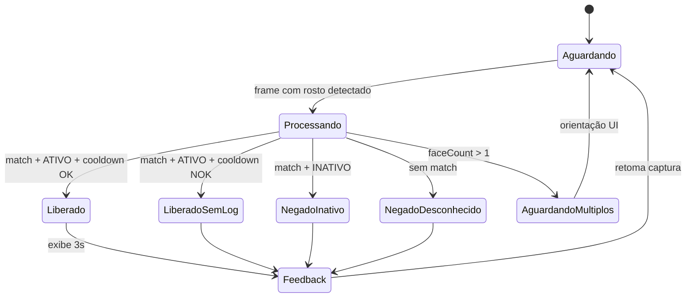
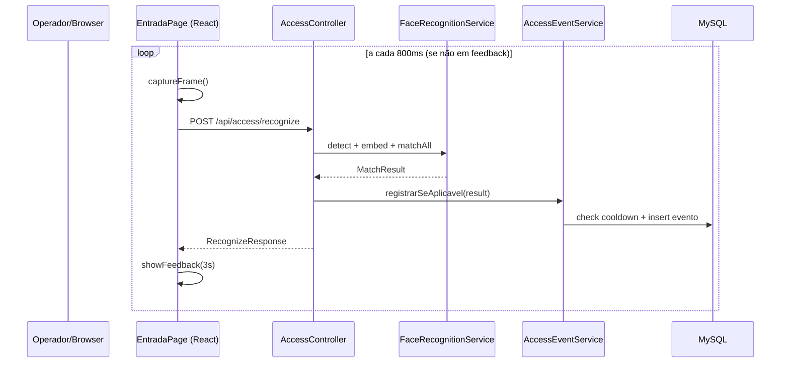

# Tela de Entrada (Reconhecimento) — Design

**Spec:** `.specs/features/tela-entrada/spec.md`  
**Arquitetura compartilhada:** `.specs/project/SYSTEM-DESIGN.md`  
**Status:** ✅ Done (2026-05-30)

---

## Architecture Overview

Tela pública fullscreen: webcam captura frames em intervalo configurável → envia ao servidor → compara embedding contra base de clientes ativos → retorna resultado com dados para feedback → frontend exibe overlay 3s → `AccessEventService` aplica cooldown antes de persistir.





---

## Code Reuse Analysis

### Existing Components to Leverage

| Component | Location | How to Use |
| --------- | -------- | ---------- |
| FaceRecognitionService | `service/FaceRecognitionService.java` | `extractEmbedding()`, `findBestMatch()` — criado no cadastro |
| ImageStorageService | `service/ImageStorageService.java` | URL da foto matched para exibição |
| WebcamCapture + useWebcam | `frontend/src/components/WebcamCapture.tsx` | Preview e captura de frames |
| face_foto + cliente tables | Flyway V1 | Embeddings e status ATIVO/INATIVO |
| application.yml face.* | config compartilhada | threshold, cooldown, interval |

### Integration Points

| System | Integration Method |
| ------ | ------------------ |
| Base facial | Lê `face_foto.embedding` JOIN `cliente` WHERE status=ATIVO |
| Fotos cadastradas | `GET /api/clientes/{id}/foto/{ordem}` ou URL presigned GCS |
| Eventos | Tabela `evento_acesso` compartilhada |

---

## Components

### EntradaPage (frontend)

- **Purpose:** Rota fullscreen `/entrada` — loop de reconhecimento, overlay de feedback, indicador de câmera.
- **Location:** `frontend/src/routes/EntradaPage.tsx`
- **Interfaces:**
  - `useRecognitionLoop({ intervalMs, feedbackSeconds })` — custom hook interno
  - renderiza `WebcamCapture`, `AccessFeedbackOverlay`, `CameraStatusIndicator`
- **Dependencies:** `useWebcam`, `accessApi.recognize`, config via env (`VITE_RECOGNIZE_INTERVAL_MS`)
- **Reuses:** Componentes em `frontend/src/components/`

**Throttling:** Hook pausa loop enquanto `feedbackActive || processing`.

### AccessFeedbackOverlay (frontend)

- **Purpose:** Overlay verde/vermelho com foto, nome e mensagem de acesso.
- **Location:** `frontend/src/components/AccessFeedbackOverlay.tsx`
- **Interfaces:** props `{ outcome, nome?, fotoUrl?, visible }`
- **Dependencies:** Tailwind (`bg-access-granted/90`, `bg-access-denied/90`)
- **Reuses:** Tokens em `tailwind.config.js` (SYSTEM-DESIGN)

### useRecognitionLoop (frontend)

- **Purpose:** Orquestrar captura → API → feedback → cooldown visual de 3s.
- **Location:** `frontend/src/hooks/useRecognitionLoop.ts`
- **Interfaces:**
  - retorna `{ feedback, multiFaceWarning, cameraOnline, retry }`
  - chama `accessApi.recognize(base64)` a cada intervalo
- **Dependencies:** `useWebcam`, `accessApi`
- **Reuses:** Config `feedbackSeconds` da API ou env

### AccessController (backend)

- **Purpose:** Endpoint público de reconhecimento e consulta de status da base.
- **Location:** `web/AccessController.java`
- **Interfaces:**
  - `POST /api/access/recognize(FaceImageRequest): RecognizeResponse`
  - `GET /api/access/status(): AccessStatusResponse` — total clientes ativos com faces
- **Dependencies:** `FaceRecognitionService`, `AccessEventService`
- **Reuses:** `@PermitAll` no SecurityConfig

### RecognizeResponse (DTO)

```java
record RecognizeResponse(
    AccessOutcome outcome,       // LIBERADO | NEGADO
    NegadoMotivo motivo,         // null se LIBERADO
    Long clienteId,              // null se NAO_RECONHECIDO
    String nome,                 // null se desconhecido
    String fotoUrl,              // null se desconhecido
    boolean eventoRegistrado,    // false se cooldown bloqueou log
    double confianca,            // score do match
    int faceCount                // 0, 1, ou >1
) {}
```

### FaceRecognitionService (métodos de match)

- **Purpose:** Comparar embedding capturado contra cache/banco de clientes ativos.
- **Location:** `service/FaceRecognitionService.java`
- **Interfaces:**
  - `detectFaces(BufferedImage img): List<BoundingBox>`
  - `extractEmbedding(BufferedImage img, BoundingBox face): float[]`
  - `findBestMatch(float[] query): Optional<MatchResult>`
  - `loadActiveEmbeddings(): void` — cache em memória; invalidar on cliente CRUD
- **Dependencies:** DJL models (ONNX), `FaceFotoRepository`
- **Reuses:** Mesmo pipeline do cadastro

**MatchResult:**

```java
record MatchResult(
    Long clienteId,
    String nome,
    ClienteStatus status,
    Long faceFotoId,
    int ordem,
    double distance,
    double confidence  // 1 - normalizedDistance
) {}
```

**Cache strategy:** `@PostConstruct` + `@EventListener` em eventos `ClienteChangedEvent` recarrega mapa `clienteId → List<EmbeddingEntry>`. Evita query MySQL a cada frame.

### AccessEventService

- **Purpose:** Regras de cooldown (5 min) e persistência de eventos.
- **Location:** `service/AccessEventService.java`
- **Interfaces:**
  - `processarReconhecimento(MatchResult|empty, RecognizeContext): AccessProcessResult`
  - `shouldRegisterLiberado(Long clienteId): boolean`
  - `shouldRegisterNegado(NegadoMotivo motivo, String cooldownKey): boolean`
- **Dependencies:** `EventoAcessoRepository`
- **Reuses:** Config `face.access.cooldown-minutes`

**Cooldown rules (ENT-12..15):**

| Cenário | Registra evento? | Cooldown key |
| ------- | ---------------- | ------------ |
| LIBERADO, 1º em 5 min | ✅ | `cliente:{id}` |
| LIBERADO, repetido <5 min | ❌ (feedback sim) | `cliente:{id}` |
| NEGADO INATIVO | ✅ sempre | `cliente:{id}:negado` |
| NEGADO desconhecido | ✅ se cooldown expirou | `unknown:{embeddingHash}`* |

\*Para desconhecido sem ID: hash dos primeiros 16 bytes do embedding ou flag `cooldown_key='unknown'` global com janela 5 min (simplificação MVP — uma negação desconhecida a cada 5 min por instância).

---

## Data Models

### EventoAcesso (entity)

```java
@Entity
@Table(name = "evento_acesso")
public class EventoAcesso {
    Long id;
    Cliente cliente;           // nullable
    AccessResultado resultado; // LIBERADO | NEGADO
    NegadoMotivo motivo;       // nullable
    BigDecimal confianca;      // nullable
    String cooldownKey;        // nullable
    Instant ocorridoEm;        // server UTC
}
```

### AccessStatusResponse

```java
record AccessStatusResponse(
    int clientesAtivosComFaces,
    boolean operacional
) {}
```

---

## UI Layout (EntradaPage)

```
┌─────────────────────────────────────────┐
│  [●] câmera online          (P2)        │
│                                         │
│     ┌─────────────────────────┐         │
│     │                         │         │
│     │    VIDEO PREVIEW        │         │
│     │      (fullscreen)       │         │
│     │                         │         │
│     └─────────────────────────┘         │
│                                         │
│  ┌─────────────────────────────────┐    │
│  │ OVERLAY (quando feedback)       │    │
│  │  [foto]  João Silva             │    │
│  │  ███ ACESSO LIBERADO ███        │    │
│  └─────────────────────────────────┘    │
└─────────────────────────────────────────┘
```

- **LIBERADO:** `bg-access-granted/90`, foto `rounded-full ring-4 ring-white`, texto "Acesso liberado".
- **NEGADO desconhecido:** `bg-access-denied/90`, sem foto, "Acesso negado".
- **NEGADO inativo:** `bg-access-denied/90`, com foto e nome, "Acesso negado".
- **Multi-face:** banner `bg-access-warning/80 text-black` sobre preview.

---

## Error Handling Strategy

| Error Scenario | Handling | User Impact |
| -------------- | -------- | ----------- |
| Webcam indisponível | `useWebcam` error state | `<WebcamError />` + botão recarregar |
| Base vazia (0 clientes ativos) | `AccessStatusResponse.operacional=false` | Banner "Nenhum cliente cadastrado" |
| faceCount > 1 | Response sem match; UI warning | "Posicione apenas uma pessoa" |
| Timeout API (>3s) | fetch abort; retry next interval | Preview continua, sem feedback |
| Match abaixo do threshold | outcome=NEGADO, motivo=NAO_RECONHECIDO | "Acesso negado" |
| Erro interno DJL | 503 + log | "Sistema temporariamente indisponível" |

---

## Tech Decisions

| Decision | Choice | Rationale |
| -------- | ------ | --------- |
| Reconhecimento server-side | POST frame → DJL match | Stack Java puro; embeddings confiáveis |
| Intervalo de captura | 800ms | Balanceia ≤2s latência vs carga CPU |
| Cache de embeddings | In-memory com invalidação | Performance para match a cada frame |
| Frontend entrada | React `EntradaPage` + Tailwind fullscreen | Mesma stack do admin |
| Estilização feedback | Tokens `access-granted/denied` | Consistência visual spec |
| Tela sem auth | `/entrada` no React Router | Spec: uso contínuo na portaria |
| Feedback mínimo 3s | `useRecognitionLoop` pause | Spec ENT-07, ENT-11 |
| Som (P3) | Web Audio API beeps | Toggle em `localStorage` |
| Indicador câmera (P2) | `CameraStatusIndicator` + track events | Detecção de desconexão |

---

## Performance Targets

| Métrica | Meta | Abordagem |
| ------- | ---- | --------- |
| Latência recognize | ≤ 2s p95 | Modelo light ONNX; cache embeddings; Cloud Run 2 vCPU |
| Acurácia | ≥ 95% | ArcFace/MobileFaceNet + threshold calibrável |
| Frames/min | ~75 max | Throttle 800ms + pause 3s feedback |

**Calibração:** Script de teste com 20 clientes cadastrados, 100 tentativas, ajustar `face.recognition.threshold` documentado em STATE.md.

---

## Requirement Mapping (Design)

| ID | Componente(s) |
| -- | ------------- |
| ENT-01..05 | EntradaPage, useRecognitionLoop, AccessController, FaceRecognitionService |
| ENT-06..08 | AccessFeedbackOverlay (liberado) |
| ENT-09..11 | AccessFeedbackOverlay (negado) |
| ENT-12..15 | AccessEventService cooldown |
| ENT-16..18 | EventoAcesso entity, AccessEventService |
| ENT-19..20 | CameraStatusIndicator |
| ENT-21..22 | useAccessSound hook (P3) |
