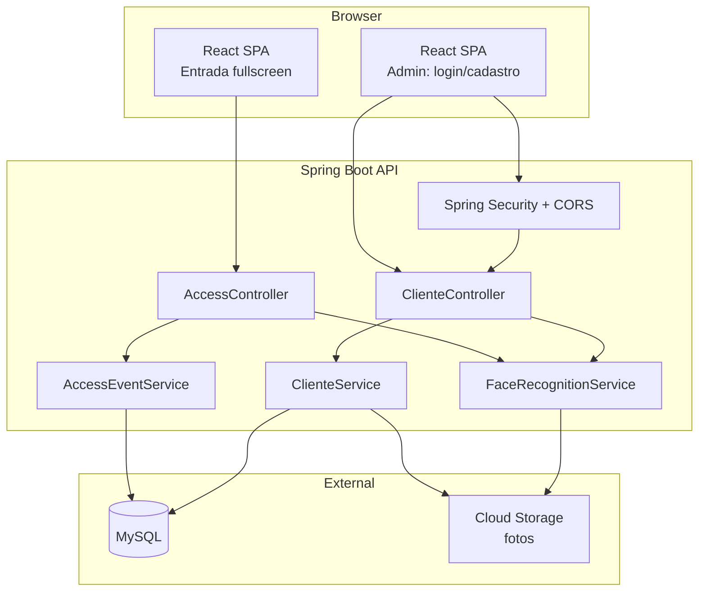
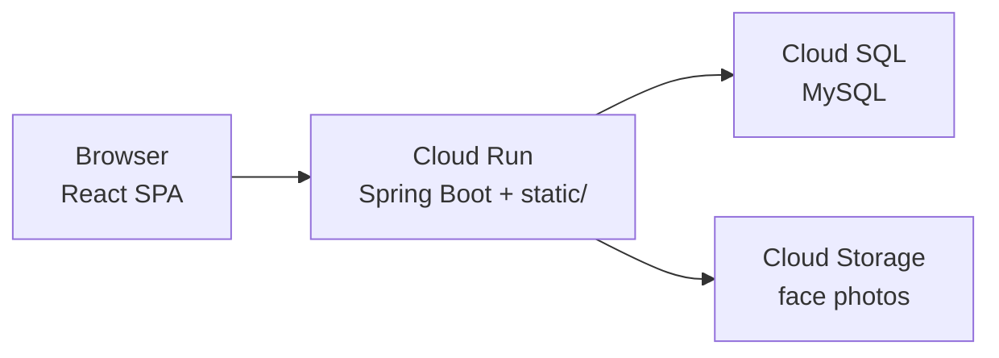

# Academia Face Access — Arquitetura do Sistema

**Status:** Implementado (MVP P1)  
**Repositório:** [github.com/pedrobelmino/spring-react-reconhecimento-facial](https://github.com/pedrobelmino/spring-react-reconhecimento-facial)  
**Escopo:** Fundação compartilhada entre cadastro e tela de entrada

---

## Visão geral

Aplicação **Spring Boot 3.x** (Java 21) como API REST + **SPA React** (Vite + TypeScript). Reconhecimento facial executado **no servidor** via DJL (Deep Java Library) com modelos ONNX embarcados. Persistência MySQL; imagens faciais em Cloud Storage (GCP) na produção, filesystem local em dev.



---

## Decisão: reconhecimento facial

| Opção avaliada | Prós | Contras | Decisão |
| -------------- | ---- | ------- | ------- |
| OpenCV LBPH (JavaCV) | Simples, exemplos em Java | Acurácia insuficiente para meta ≥95% | ❌ Rejeitada |
| face-api.js (browser) | Tempo real, sem carga no servidor | Lógica ML fora do stack Java; vetores gerados no cliente | ⚠️ Fallback |
| **DJL + ONNX Runtime** | Java nativo; detecção + embeddings modernos | Setup inicial de modelos mais complexo | ✅ **Escolhida** |
| Microserviço Python | Ecossistema ML rico | Infra extra; foge do stack definido | ❌ Rejeitada |

**Pipeline DJL:**
1. **Detecção:** Ultra-Light Face Detector (ONNX, ~1MB) — rápido para validação em cadastro e entrada.
2. **Embedding:** Modelo ArcFace/MobileFaceNet via ONNX — vetor `float[512]`.
3. **Match:** distância euclidiana normalizada; limiar padrão `0.6` (calibrável via `application.yml`).

**Fallback documentado:** Se integração DJL de embedding atrasar MVP, usar **face-api.js** no browser para gerar vetores 128-d e persistir no mesmo schema (`embedding` com dimensão registrada). Servidor continua responsável por persistência e cooldown de eventos.

---

## Stack técnica

| Camada | Tecnologia |
| ------ | ---------- |
| Runtime | Java 21 |
| Framework | Spring Boot 3.3+, Spring Web, Spring Data JPA, Spring Security |
| Migrations | Flyway |
| ML | DJL 0.27+, ONNX Runtime engine |
| DB | MySQL 8.x |
| Frontend | React 18 + TypeScript + Vite + React Router |
| Estilização | **Tailwind CSS v3** + `@tailwindcss/forms` |
| HTTP client | fetch com `credentials: 'include'` (sessão cookie) |
| Build frontend | Vite → `backend/src/main/resources/static/` |
| Build backend | Maven |
| Container | Docker → GCP Cloud Run |
| DB prod | Cloud SQL MySQL |
| Imagens prod | Google Cloud Storage bucket |

---

## Estrutura do repositório

```
tlc-example1/
├── backend/                          # Spring Boot (Java 21)
│   └── src/main/java/br/com/academia/faceaccess/
│       ├── FaceAccessApplication.java
│       ├── config/
│       │   ├── SecurityConfig.java
│       │   ├── WebConfig.java       # CORS dev + SPA fallback
│       │   └── FaceRecognitionConfig.java
│       ├── domain/
│       ├── repository/
│       ├── service/
│       └── web/                     # REST controllers only
│   └── src/main/resources/
│       ├── application.yml
│       ├── db/migration/
│       └── static/                  # build output do React (prod)
│
└── frontend/                        # React SPA
    ├── package.json
    ├── vite.config.ts               # proxy /api → :8080 em dev
    ├── tailwind.config.js
    ├── postcss.config.js
    └── src/
        ├── index.css                # @tailwind base/components/utilities
        ├── main.tsx
        ├── App.tsx
        ├── routes/
        │   ├── LoginPage.tsx
        │   ├── ClienteListPage.tsx
        │   ├── ClienteFormPage.tsx
        │   └── EntradaPage.tsx
        ├── components/
        │   ├── WebcamCapture.tsx    # hook + preview compartilhado
        │   ├── AdminLayout.tsx
        │   ├── ProtectedRoute.tsx
        │   └── AccessFeedbackOverlay.tsx
        ├── hooks/
        │   ├── useWebcam.ts
        │   └── useAuth.ts
        ├── api/
        │   ├── client.ts            # fetch wrapper + CSRF
        │   ├── authApi.ts
        │   ├── clientesApi.ts
        │   └── accessApi.ts
        └── types/
```

---

## Tailwind — convenções de UI

**Setup:** `tailwindcss`, `postcss`, `autoprefixer`, `@tailwindcss/forms` via Vite plugin.

**`tailwind.config.js` — tokens do projeto:**

```javascript
theme: {
  extend: {
    colors: {
      access: {
        granted: '#22c55e',   // green-500 — acesso liberado
        denied: '#ef4444',    // red-500 — acesso negado
        warning: '#eab308',   // yellow-500 — multi-face
      },
    },
  },
},
content: ['./index.html', './src/**/*.{ts,tsx}'],
```

**Padrões por área:**

| Área | Classes base |
| ---- | ------------ |
| Admin layout | `min-h-screen bg-gray-50`, navbar `bg-white shadow` |
| Formulários | `@tailwindcss/forms`, inputs `rounded-lg border-gray-300` |
| Botões primários | `bg-blue-600 hover:bg-blue-700 text-white rounded-lg px-4 py-2` |
| Tabela clientes | `divide-y divide-gray-200`, status badge `rounded-full px-2 py-1 text-xs` |
| Entrada fullscreen | `fixed inset-0 bg-black`, video `object-cover w-full h-full` |
| Overlay liberado | `bg-access-granted/90 text-white` |
| Overlay negado | `bg-access-denied/90 text-white` |

**Regras:**
- Estilização **somente** via classes Tailwind — sem CSS modules nem arquivos `.css` por componente (exceto `index.css` com directives `@tailwind`).
- Componentes reutilizáveis (`Button`, `Badge`, `Card`) opcionais — wrappers com `className` prop via `clsx` + `tailwind-merge`.

---

## Modelo de dados (compartilhado)

### admin_user

| Coluna | Tipo | Notas |
| ------ | ---- | ----- |
| id | BIGINT PK | auto |
| username | VARCHAR(50) UNIQUE | |
| password_hash | VARCHAR(255) | BCrypt |
| created_at | TIMESTAMP | UTC |

### cliente

| Coluna | Tipo | Notas |
| ------ | ---- | ----- |
| id | BIGINT PK | |
| nome | VARCHAR(120) | |
| cpf | VARCHAR(11) UNIQUE | só dígitos |
| status | ENUM('ATIVO','INATIVO') | default ATIVO |
| created_at | TIMESTAMP | |
| updated_at | TIMESTAMP | |

### face_foto

| Coluna | Tipo | Notas |
| ------ | ---- | ----- |
| id | BIGINT PK | |
| cliente_id | BIGINT FK | |
| ordem | TINYINT | 1 ou 2 |
| storage_key | VARCHAR(255) | path GCS ou local |
| embedding | VARBINARY(2048) | 512 floats |
| embedding_dim | SMALLINT | 512 (ou 128 no fallback) |
| created_at | TIMESTAMP | |

**Constraint:** UNIQUE(cliente_id, ordem)

### evento_acesso

| Coluna | Tipo | Notas |
| ------ | ---- | ----- |
| id | BIGINT PK | |
| cliente_id | BIGINT FK NULL | null se não reconhecido |
| resultado | ENUM('LIBERADO','NEGADO') | |
| motivo | ENUM('NAO_RECONHECIDO','CLIENTE_INATIVO') NULL | |
| confianca | DECIMAL(5,4) NULL | score do match |
| ocorrido_em | TIMESTAMP | UTC, server-side |
| cooldown_key | VARCHAR(64) NULL | hash para cooldown de desconhecido |

**Índices:** `(cliente_id, ocorrido_em)`, `(cooldown_key, ocorrido_em)`

---

## Configuração (application.yml)

```yaml
face:
  recognition:
    threshold: 0.6
    embedding-dim: 512
  access:
    cooldown-minutes: 5
    feedback-seconds: 3
    recognize-interval-ms: 800

storage:
  type: local  # local | gcs
  local-path: ./data/faces
  gcs-bucket: ${GCS_BUCKET:}
```

---

## Segurança

| Rota API | Acesso |
| -------- | ------ |
| `POST /api/auth/login` | público |
| `/api/access/**` | público (portaria) |
| `/api/clientes/**`, `/api/faces/**`, `/api/auth/logout`, `/api/auth/me` | autenticado (sessão) |

| Rota React (client-side) | Proteção |
| ------------------------ | -------- |
| `/login` | público |
| `/entrada` | público |
| `/admin/**` | `ProtectedRoute` + redirect se 401 |

- Sessão HTTP com cookie `HttpOnly`, `SameSite=Lax`.
- CSRF: Spring envia token via cookie `XSRF-TOKEN`; React lê e envia header `X-XSRF-TOKEN` em mutações.
- **CORS (dev):** Vite `:5173` → Spring `:8080` com `allowCredentials: true`.
- **Prod:** React servido pelo Spring em `/static`; mesma origem, sem CORS.
- Senha admin inicial via seed Flyway ou env `ADMIN_PASSWORD`.
- **SPA fallback:** `WebConfig` redireciona rotas não-API para `index.html`.

---

## Deploy GCP (MVP)



- **Build:** `npm run build` (frontend) → copia para `backend/src/main/resources/static/` → `mvn package`.
- **Dev:** `backend :8080` + `frontend npm run dev :5173` com proxy Vite.

- **Cloud Run:** 2 vCPU, 2Gi RAM (DJL inference).
- **Cloud SQL:** MySQL 8, tier db-f1-micro (dev) / db-custom (prod).
- **Secrets:** senha DB, admin, via Secret Manager.

---

## Referências de pesquisa

- [DJL Face Detection](https://docs.djl.ai/master/examples/docs/face_detection.html) — RetinaFace / Ultra-Light detector
- [DJL Spring Boot Starter](https://github.com/deepjavalibrary/djl-spring-boot-starter) — autoconfig inference
- [Spring Vision](https://github.com/codesapienbe/spring-vision) — alternativa com RetinaFace bundled (avaliar se DJL puro for complexo)
